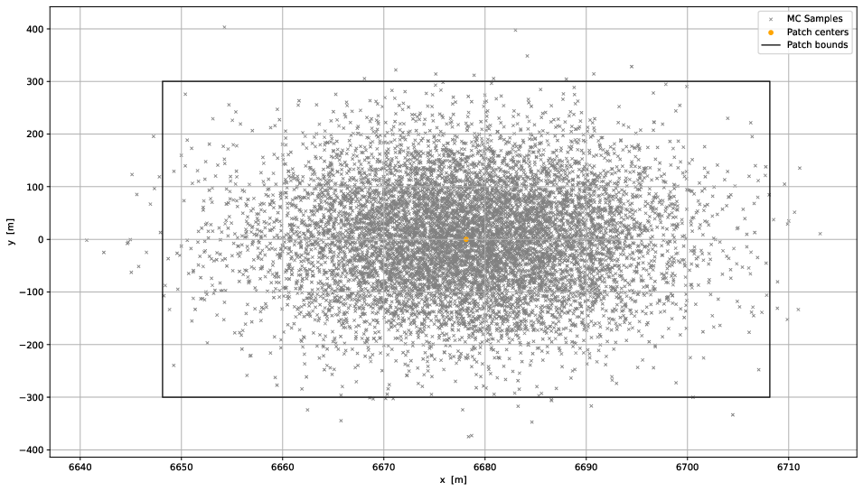

# M.Sc. Aerospace Engineering
## ISAE-Supaero M.Sc. in Aerospace Engineering with major in Embedded Systems
### Currently, in search of an internship starting by April 2024

## Education

- **Aerospace Engineering, M.Sc.** - ISAE-Supaero - *September 2022 - Present (2 yr.)*
- **Bachelor's Final Thesis** - Politecnico di Torino - *February 2021 - July 2021 (6 mo.)*
- **Aerospace Systems Engineering, B.Eng.** - Universitat Politècnica de Catalunya - *February 2017 - July 2021 (4 yr.)*

## Work Experience

- **Software Engineer for Research in Air Traffic Management (ATM) - Universitat Politècnica de Catalunya** - *October 2021 - October 2022 (1 yr.)*
  - Developer in C++ of a trajectory optimization for commercial aircraft.
  - EU project involved: [CREATE](https://create-project.eu). Coordinated with other companies within the field (i.e., NLR).
  - Published paper in Proceedings of SESAR Innovation Days (SIDs) 2022. [Available here](https://www.researchgate.net/publication/366617093_Alternative_4D_Trajectories_for_the_avoidance_of_weather-_and_contrail-sensitive_volumes).
  - Aircraft performance models from [Base of Aircraft Data](https://www.eurocontrol.int/model/bada) (BADA) from EUROCONTROL.
  - Maintenance and overhaul from reported bugs from users and clients.
  - Implementation of new features, integration, data flow management, validation analysis, stress test software design, etc.
  - Reference: [Xavier Prats, PhD](mailto:xavier.prats@upc.edu)

- **Electronics Graduate Teaching Assistant - Universitat Politècnica de Catalunya** - *September 2020 - January 2021 (6 mo.)*
  - Electronics of Telecommunications assistant lecturer for the freshmen of the telecommunications program.
  - Lecturer of basic electronic instruments at the laboratory such as: power suppliers, signal generators, oscilloscopes. As well as other electronic components: transistors, AOs, capacitors, resistors, etc.
  - [Reference letter](https://drive.google.com/file/d/1tJ3tT5xtQtYZQvB0BsHpI6L2lFiaL0D8/view).

## Projects

Herein this section you will find some of the work I've achieved so far, going from the newest challenges to the oldest ones. All of which I consider have enriched me throughout my academic life.

### Dassault UAV Challenge - 1st Prize

#### *Dassault Aviation - September 2022 - April 2023 (8 mo.)*

At the beginning of my masters course, some of my colleagues and I enrolled in what came to be one of my best experiences in the aeronautics world.

Dassault UAV Challenge is designed for those students eager to try their boldest ideas. And that's what we did.

Our mission, which was to create a platform capable of demonstrating the deployment of a ballistic free fall medical delivery after visual input for the hypothetical case of a natural disaster event, achieved successfully its purpose, therefore winning the first prize.

My contribution focused on the core of the mission, which was the visual detection of an Aruco (or QR) marker on ground, after which a trap-door would open in order to place the good at the service of the injured. 

The whole mission can be step-by-step revised in the following video here below (if image not available, [click here](https://youtu.be/wZw2LPafCyY)):

The first prize of the competition was awarded to my team, being honoured with a VIP visit to Le Bourget Airport, for the Paris Airshow 2023, by the hand of Dassault Aviation. There, I had the opportunity to interact with their staff, who showcased their innovations, such as VR training models for fighter jet overhauling, new features under development in their simulators, and much more. We all really enjoyed the experience. See network impact [here](https://www.linkedin.com/posts/dassault-aviation_siae2023-uavchallenge2024-dassaultaviation-activity-7084529848718618624-EdqV?utm_source=share&utm_medium=member_desktop).

<!--  -->

### Orbit Uncertainties Propagator
#### *January 2023 - June 2023*

Within the frame of my M.Sc. in Aerospace Engineering at ISAE-Supaero, a research project is carried out in order to work hand in hand with their research department. In my case, I was offered a position in the *Département Conceptinon et conduite des véhicules Aéronautiques et Spatiaux* (DCAS). My mission consisted in developing a simulator for uncertainties propagation. 

This project is the first step towards a cleaner space, where non-cooperative targets will be chased by an autonomous self-navigating satellite capable of predicting the future states of debris, un-operative satellites, meteorites, asteroids and much more.

This can only be attained by predicting all the most likely future state of those spatial objects, and this problem can be solved using Differential Algebra.

The software, written in C++, developed in GitHub by the name of [VerneDA](https://github.com/bryanitou/VerneDA.git), has two main propagation engines:

- Translational: the state is composed by position and speed.
- Rotational: the state is composed by attitude, orientation and angular speeds. Plus th inertia matrix of the object is required for this engine.

Both engines need, in order to work, an initial state with their belonging probability function (i.e., Gauss, Uniform, etc.). Usually normal distribution is widely used for this purpose.

Here an example below about the uncertainty propagation in the translational dimension, for an initial state of X = [6678.135, 0.0, 0.0, 0.0, 9.46208, 0.0].

Being the initial scenario:

Being the final scenario after 1.5 revolutions:

### Rotational simulation
#### *During my free time*

Recently, for the Orbit Uncertainties Propagator mentioned above, I have been developing a rotational simulator using OpenCV for validation purposes for the rotational engine of VerneDA software.
You can find this repository as a fork of [zainkhan-afk](https://github.com/zainkhan-afk/OpenCV-3D-Renderer.git).
I added some extra work and my contributions can be followed in this other repository: [Open-CV-Renderer](https://github.com/bryanitou/OpenCV-3D-Renderer.git).

As it can be seen in the image below, the code has the capability of handling Hierarchical Transformations.
Panels rotate along their own axis alongside the main rotation of the cube.

### Path finding algorithms
#### *During my free time*

For the completion of my bachelor studies, I worked in Politecnico di Torino for 6 months, hand in hand with Stefano Primatesta, PhD. He introduced me to the world of path-finding algorithms. These new methods were being studied for a wide variety of robots, such as underwater, surface and aerial robots (UAVs).

The bachelor thesis (available [here](https://upcommons.upc.edu/handle/2117/350246)) was focused on random sampled based algorithms which, as their name states, are not deterministic. However, they expose great interest in those complex scenarios (i.e., maze) where the path is (probabilistically) found at a greater pace using random algorithms such as PRM, RRT and their families.

From this brief introduction, I continued my own work, developing code to examine and study them more in detail, as well as discovering new horizons of commercialization of these random algorithms, which in the world of aeronautics have little hope right now. However, their presence can increase with good studies and better understanding of their behavior, especially from the probabilistic point of view, to ensure safety first among all the other solid characteristics that the world of aeronautics is known for.

The project I mentioned in the previous paragraph can be found in GitHub, and receives the name of [Pathfinder](https://github.com/bryanitou/pathfinder.git). It is using Open Motion Planning Library (OMPL).

The tool has these main features:

- Encapsulation of the problem in a JSON file (i.e., initial/final pose, bounds, etc.)
- Square-modelling of obstacles
- 2D expandable to 3D
- Modular programming for fast execution and substitution of modules

Here below, there is an example of a solution within *Dubin* space, where a solution is found in less than half of a second. More complex scenarios and detailed explanation of the literature can be found in my bachelor's thesis mentioned above.

Obstacles are the square objects, while the resultant path is drawn in a pink line. Plus, the second graph indicates the steering angle in the X-Y plane.

The figure below, depicts the RRT (Rapidly exploring Random Tree) branches.

## Disclaimer

In the projects section described above some of the references are missing. However, they are included in the links I provide. In each one, the formal presentation of the project is being carried out. This portfolio is just a glimpse of what my projects are about.
